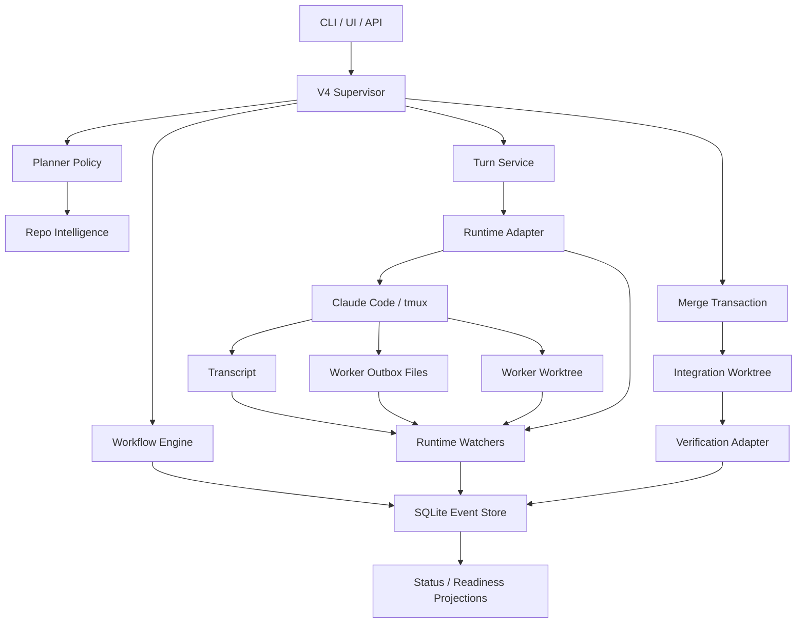

# V4 Event-Native Agent Filesystem Design

Date: 2026-05-02
Status: Approved for implementation planning

## Purpose

V4 should become the main orchestration path for a stable, powerful multi-agent file-system runtime. The system should no longer treat tmux terminal output as the source of truth. Terminal output is useful evidence, but durable state must come from structured events, worker result files, message delivery records, merge artifacts, and verification evidence.

The target shape is an event-native agent system:

- Codex is the supervisor and final decision maker.
- Claude Code workers are disposable subagents with explicit contracts.
- Each worker turn produces durable event evidence and structured filesystem artifacts.
- The project can recover after process restart by replaying V4 events and reading the agent filesystem.
- Accepting work means applying worker changes through a verified merge transaction, not merely finalizing a crew record.

This design follows the direction of strong open-source agent-team systems:

- OpenHands style action-observation/event runtime: <https://docs.openhands.dev/sdk/arch/events>
- LangGraph style durable execution and checkpointing: <https://docs.langchain.com/oss/python/langgraph/durable-execution>
- pi-agentteam style shared task board, typed messaging, and event-driven wakeups: <https://pi.dev/packages/pi-agentteam>
- CrewAI separation of control flow and execution crews: <https://docs.crewai.com/en/introduction>
- AutoGen team patterns with explicit handoffs and team control loops: <https://microsoft.github.io/autogen/dev/user-guide/agentchat-user-guide/tutorial/teams.html>

The implementation should adapt these ideas to this repo instead of copying their abstractions directly.

## Current Problems

The current code already has a V4 event store and workflow foundation, but the active orchestration path still has V3 assumptions.

1. Completion depends too much on tmux output and marker detection.
   `src/codex_claude_orchestrator/runtime/native_claude_session.py` captures the pane and searches for a marker. This is fragile because terminal output can be stale, clipped, quoted, reformatted, or missing a marker.

2. V4's tmux adapter still performs a one-shot observe.
   `src/codex_claude_orchestrator/v4/adapters/tmux_claude.py` wraps the same snapshot behavior instead of tailing transcript/output and ingesting durable events.

3. Dynamic decisions are rule-oriented.
   `src/codex_claude_orchestrator/crew/decision_policy.py` decides primarily from keywords, changed files, worker capabilities, and failure counts. It does not model dependency boundaries, test mapping, ownership, file risk, or worker quality history.

4. Worker reuse is under-constrained.
   `src/codex_claude_orchestrator/workers/pool.py` checks capability, authority, and workspace mode, but not strict write-scope compatibility or contract compatibility before reusing an active worker.

5. Message bus is not closed-loop.
   `src/codex_claude_orchestrator/messaging/message_bus.py` can store messages and read an inbox, but worker turns do not automatically include unread inbox digest, protocol requests, or delivery acknowledgements.

6. Merge and accept are too thin.
   `src/codex_claude_orchestrator/crew/merge_arbiter.py` only detects same-file conflicts. `CrewController.accept()` finalizes and stops workers without applying worker patches into an integration workspace and validating the result.

7. V4 is not yet the main CLI path.
   `src/codex_claude_orchestrator/cli.py` exposes V4 events, but normal crew run/supervision still leans on V3 controller behavior.

## Goals

- Make V4 the default orchestration path for `crew run`, `crew supervise`, `crew status`, `crew accept`, and event inspection.
- Replace marker-only completion with multi-source completion evidence.
- Introduce an agent filesystem where workers write structured outbox/result artifacts.
- Close the message bus loop so every worker turn includes unread inbox, open protocol requests, and delivery/read evidence.
- Make worker reuse safe by comparing contract compatibility, write scope, workspace mode, authority, and worker state.
- Add a merge transaction that applies worker changes into an integration worktree, validates write scope, resolves conflicts, and verifies the final workspace before accept.
- Upgrade decision-making from simple routing rules to a planner that uses repo intelligence and risk signals.
- Preserve V3 compatibility while moving user-facing commands to V4.

## Non-Goals

- Do not build a general-purpose replacement for Claude Code.
- Do not require workers to run without tmux in the first V4 path. The runtime should support tmux as an adapter, but tmux should not be the source of truth.
- Do not remove V3 immediately. It remains a compatibility layer until V4 commands cover the required workflows.
- Do not make LLM-based planning the only safety layer. Deterministic gates remain mandatory for scope, merge, and verification.

## Architecture Overview



The main boundary is:

- Runtime adapters deliver turns and expose raw runtime signals.
- Watchers translate raw signals and filesystem artifacts into durable V4 events.
- Workflow and projections decide state from events, not from live terminal state.
- Merge and accept operate on patches/artifacts and final verification evidence.

## Agent Filesystem

Each crew owns a durable filesystem area under the existing recorder/artifact root. V4 should standardize these paths.

```text
.codex/crew/<crew_id>/
  events.sqlite
  manifest.json
  workers/
    <worker_id>/
      contract.json
      allocation.json
      onboarding_prompt.md
      transcript.txt
      inbox/
        <message_id>.json
      outbox/
        <turn_id>.json
      patches/
        <turn_id>.patch
      changes/
        <turn_id>.json
      logs/
        runtime.log
  messages/
    messages.jsonl
    cursors.json
    deliveries.jsonl
  merge/
    plan.json
    integration.patch
    conflicts.json
    verification.json
  projections/
    status.json
    readiness.json
```

The exact physical root can remain the existing crew artifact directory. The important change is that V4 owns a stable schema and treats these files as durable artifacts referenced by events.

## Event Model

V4 events are the durable control plane. Every event must have:

- `event_id`
- `stream_id`
- `type`
- `crew_id`
- optional `worker_id`
- optional `turn_id`
- optional `round_id`
- optional `contract_id`
- `payload`
- `artifact_refs`
- `created_at`
- `idempotency_key`

Core event families:

```text
crew.started
crew.status_changed
worker.spawn_requested
worker.spawned
worker.stopped
contract.created
contract.superseded
message.created
message.delivered
message.read
turn.requested
turn.delivery_started
turn.delivered
runtime.output.appended
runtime.process_exited
worker.outbox.detected
worker.patch.detected
marker.detected
turn.completed
turn.inconclusive
turn.failed
turn.timeout
review.requested
review.completed
verification.started
verification.passed
verification.failed
merge.planned
merge.started
merge.conflicted
merge.completed
crew.ready_for_accept
crew.accepted
human.required
```

Event replay must be sufficient to rebuild crew status, active workers, open turns, message cursors, readiness, and acceptability.

## Runtime Watchers

The current observe loop should be replaced with a watcher pipeline. It can still poll internally at first, but the state model should be event ingestion, not "capture pane and decide."

Watchers:

1. `TranscriptTailWatcher`
   Reads `transcript.txt` incrementally using byte offsets. Emits `runtime.output.appended` events. This avoids reprocessing the whole terminal snapshot.

2. `OutboxWatcher`
   Reads worker result files from `workers/<worker_id>/outbox/<turn_id>.json`. Emits `worker.outbox.detected`, `turn.completed`, or `turn.inconclusive` depending on schema validity and turn match.

3. `PatchWatcher`
   Detects patch/change summaries from worker worktree or explicit patch files. Emits `worker.patch.detected` and links changed-file artifacts.

4. `MarkerDetector`
   Detects expected marker in new transcript output. Emits `marker.detected`. Marker is completion evidence, not the only completion condition.

5. `ProcessWatcher`
   Detects process exit or missing tmux session. Emits `runtime.process_exited` and can lead to `turn.failed` if no completion artifact exists.

6. `TimeoutWatcher`
   Checks turn deadline and emits `turn.timeout` when no valid completion evidence exists.

Completion precedence:

1. Valid outbox result for the current `turn_id` wins.
2. Expected marker for the current turn completes if no contradictory failure exists.
3. Contract-level marker without turn-specific result is inconclusive.
4. Process exit before completion is failed.
5. Deadline reached before completion is timeout.
6. Any stale marker or quoted marker is ignored unless tied to the current turn.

## Worker Turn Protocol

Every worker turn should be delivered as a structured envelope. The human-readable prompt may remain markdown, but the content should be generated from a structured model.

Turn envelope fields:

```text
crew_id
worker_id
turn_id
round_id
phase
contract_id
message
expected_marker
required_outbox_path
allowed_write_scope
acceptance_criteria
unread_inbox_digest
open_protocol_requests
blackboard_highlights
deadline_at
attempt
```

Workers must be asked to produce a result file:

```json
{
  "crew_id": "crew-v4-runtime",
  "worker_id": "worker-source-1",
  "turn_id": "round-1-worker-source",
  "status": "completed",
  "summary": "Added transcript tail ingestion and outbox completion handling.",
  "changed_files": ["src/codex_claude_orchestrator/v4/watchers.py"],
  "verification": [
    {
      "command": ".venv/bin/python -m pytest tests/v4 -q",
      "status": "passed",
      "summary": "V4 test suite passed."
    }
  ],
  "messages": [],
  "risks": [],
  "next_suggested_action": "review"
}
```

If a worker cannot write the outbox file, it must report why in terminal output. The supervisor can then mark the turn inconclusive and decide whether to retry, repair the prompt, or require human input.

## Message Bus Closed Loop

The message bus should become a real delivery system rather than a passive log.

Changes:

- `AgentMessageBus.send()` still appends messages.
- A new `TurnContextBuilder` reads unread inbox messages for the target worker.
- `send_worker` / V4 turn delivery injects unread inbox digest and open protocol requests into the turn envelope.
- Message cursors are advanced only after `turn.delivered` or explicit `message.read`.
- Worker outbox can include responses or handoff messages. Watchers append those to the bus and emit `message.created`.
- Delivery records should include `message_id`, `worker_id`, `turn_id`, and delivery event id.

This prevents the failure mode where messages exist in storage but the worker never sees them.

## Worker Lifecycle and Reuse

The default V4 behavior should follow the subagent-driven model:

- Fresh worker per implementation task.
- Separate fresh workers for spec review and code quality review.
- Read-only review or verification workers may be reused only when safe.

Reuse compatibility must check:

- Worker is active and healthy.
- Required capabilities are covered.
- Worker authority covers the requested authority.
- Workspace mode matches.
- Existing worker write scope covers the new contract write scope.
- Contract label/mission is compatible.
- Worker does not have blocking unread protocol requests.
- Worker worktree dirty state is compatible with the new task.
- Worker recent quality score is acceptable.

If any check fails, V4 spawns a new worker rather than reusing context.

## Planner and Repo Intelligence

`CrewDecisionPolicy` should evolve into a planner with deterministic guardrails.

Repo intelligence should provide:

- Changed files and ownership.
- Package/module boundaries.
- Import/dependency graph.
- Test mapping from source paths to likely test commands.
- File risk classification: config, migration, generated file, public API, docs, UI, backend, tests.
- Historical failure clusters.
- Worker quality history.

Planner actions:

- Spawn source worker.
- Spawn context scout.
- Spawn patch reviewer.
- Spawn verification worker.
- Spawn browser/e2e worker.
- Split task into subcontracts.
- Retry current worker with correction.
- Stop or quarantine worker.
- Request human input.
- Start merge transaction.
- Mark ready for accept.

Rules still exist as safety gates, but planning should be informed by repository structure and evidence.

## Merge and Accept Transaction

Accepting a crew must become a transaction.

Transaction stages:

1. Collect worker changes.
   Read worker changes artifacts, patch files, worktree diffs, and declared changed files.

2. Validate scope.
   Every changed path must be allowed by the worker's contract write scope. Out-of-scope changes block merge.

3. Build merge plan.
   Detect same-file conflicts, dependency conflicts, API/test conflicts, generated-file conflicts, migration/config conflicts, and overlapping ownership.

4. Create integration worktree.
   Apply accepted worker patches in deterministic order.

5. Run targeted verification.
   Use repo intelligence and worker-provided verification evidence to choose commands.

6. Run final verification.
   Run the final required command set on the integrated workspace, not inside a worker's private worktree.

7. Record merge evidence.
   Write merge plan, patch, conflict summary, verification result, and changed files under `merge/`.

8. Update main workspace.
   Apply the verified integration result to the user's workspace only after the transaction passes.

9. Accept crew.
   Emit `crew.accepted`, finalize projections, and stop workers.

If any step fails, emit a blocking event and leave worker worktrees intact for inspection.

## CLI and UI Migration

V4 should become the default behavior:

```text
crew run          -> V4 supervisor
crew supervise    -> V4 workflow loop
crew status       -> V4 projections
crew events       -> V4 event store
crew worker send  -> V4 turn delivery
crew worker tail  -> V4 transcript/artifact tail
crew accept       -> V4 merge transaction
```

V3 remains accessible through explicit legacy paths or compatibility adapters. The CLI should avoid presenting V3 and V4 as two equally primary systems.

## Error Handling

The system should fail into inspectable states.

- Missing marker: inconclusive unless outbox result is valid.
- Missing outbox: inconclusive, then retry or human-required depending on attempts.
- Stale marker: ignored if not tied to the current turn.
- Worker process exit: failed if no completion evidence exists.
- Delivery conflict: existing `turn.delivery_started` prevents duplicate sends.
- Message delivery failure: cursor is not advanced.
- Scope violation: merge blocked.
- Verification failure: merge blocked and planner receives failure evidence.
- Event store duplicate: idempotency key returns existing event.

## Testing Strategy

Unit tests:

- Event append idempotency.
- Projection rebuild from events.
- Transcript tail offset handling.
- Outbox schema validation.
- Marker detection ignores stale markers.
- Message cursor advances only after delivery/read.
- Worker reuse rejects incompatible write scope.
- Merge arbiter detects scope and dependency conflicts.
- Completion detector precedence.

Integration tests:

- Turn completes through outbox without marker.
- Turn completes through marker without outbox.
- Turn fails on process exit without completion.
- Restart and replay resumes waiting turn without duplicate delivery.
- Worker message round-trip appears in next turn context.
- Accept applies patch in integration worktree and verifies before finalization.

Regression tests:

- Existing V4 tests keep passing.
- Existing V3 CLI compatibility tests keep passing until the command is intentionally migrated.

Target verification after implementation:

```text
.venv/bin/python -m pytest tests/v4 -q
.venv/bin/python -m pytest tests/messaging tests/workers tests/crew -q
.venv/bin/python -m pytest tests/cli/test_cli.py tests/ui/test_server.py -q
.venv/bin/python -m pytest -q
```

## Rollout Plan

Phase 1: V4 protocol foundation

- Add turn context builder.
- Add outbox result schema.
- Add message delivery/read events.
- Add worker compatibility checks.

Phase 2: Watcher pipeline

- Add transcript tail watcher.
- Add outbox watcher.
- Add marker detector as event source.
- Add process/timeout events.
- Update V4 supervisor to consume watcher events.

Phase 3: Merge transaction

- Add patch collection.
- Add write-scope validation.
- Add integration worktree.
- Add final verification adapter.
- Make accept depend on merge transaction.

Phase 4: V4 main path

- Route primary CLI commands to V4.
- Keep legacy commands explicit.
- Update UI status from V4 projections.

Phase 5: Planner upgrade

- Add repo intelligence.
- Add test mapping.
- Add risk scoring.
- Add worker quality history.
- Upgrade planner actions.

## Acceptance Criteria

- A worker can complete a turn by writing a valid outbox result even if it never prints the marker.
- A missing marker cannot leave the crew permanently stuck in `waiting_for_worker` when other terminal evidence exists.
- The next worker turn always includes unread inbox digest and open protocol requests.
- Message cursors are not advanced before delivery/read evidence.
- A worker with incompatible write scope is not reused.
- Accept cannot finalize without a successful merge transaction and final verification in an integration workspace.
- V4 event replay can reconstruct crew status and readiness.
- CLI primary crew flow uses V4 supervisor and projections.
- Full test suite passes.

## Risks and Mitigations

Risk: Worker fails to write the required outbox file.

Mitigation: Keep marker detection and transcript evidence as fallback, but classify the turn as inconclusive after bounded retries.

Risk: More event types make projections more complex.

Mitigation: Keep event schemas narrow, add projection tests, and treat projections as derived state that can be rebuilt.

Risk: Merge transaction may be slow for small tasks.

Mitigation: Use targeted verification first, but keep final verification mandatory before accept.

Risk: V3 compatibility becomes confusing.

Mitigation: Make V4 the default CLI path and name V3 access explicitly as legacy.

Risk: Planner becomes overfit to rules.

Mitigation: Separate deterministic safety gates from repo intelligence and planner scoring. Safety gates block dangerous actions; planner chooses useful next actions.
